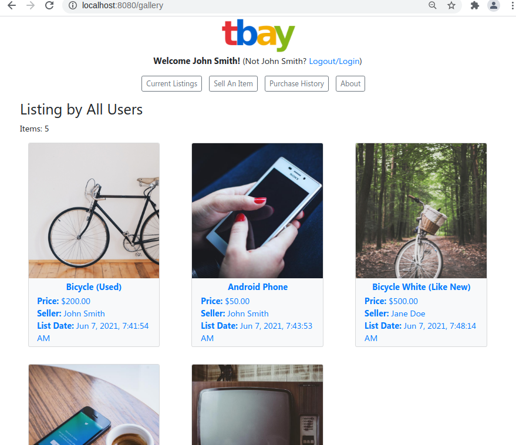
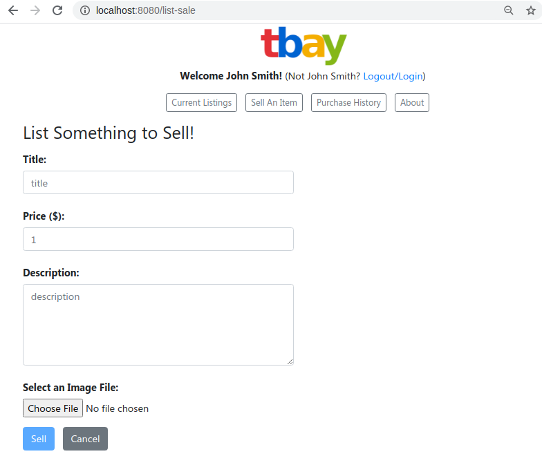
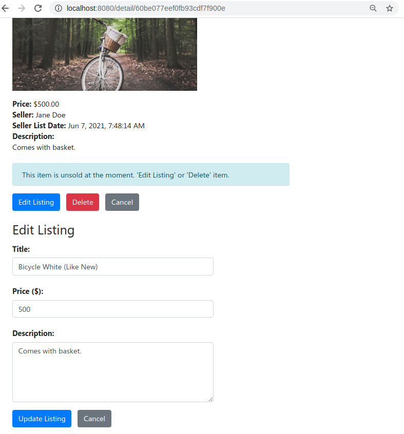
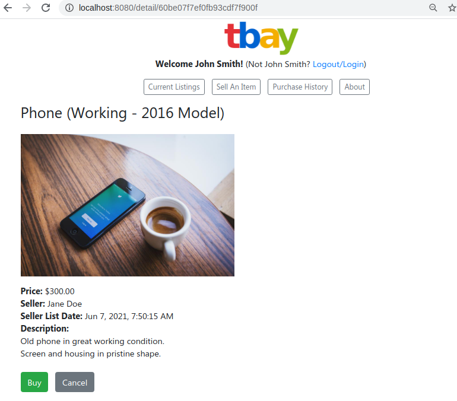

# TBay Online MarketPlace

This repository contains an original web application developed as part of multiple assignments for 'CSCI E-31 Web Application Development using Node.JS'.  The application is built using  the MEAN stack and permits CRUD operation to list and buy items for sale.  The assignment instructions provided included in `assignment_instruction.md`.

Functionalities, include:

1. a single page application with persistent storage to track the user
    

2. the ability to list items for sale
    

3. the ability to edit listings for the same user
    

4. the ability to buy items from other users
    

## Initial Setup

This project requires `npm`, `node`, and `angular/cli`.  Check your distribution to see how to install these packages.


## Installation On Localhost

Installation instructions differ for localhost and for production copies of this program.  The following instructions are for running this application on localhost.

### MongoDB Container
Before running the following applications, start MongoDB with instruction in `tbay-mongo/`.

### Express Application
To run the Express application install node.js and npm.  Then run `npm install` in the `tbay-express` folder, and then run `npm start`.

A browser can then point to `localhost:8080` to view to the contents of the Angular distribution application.

The Express application includes PUG views that can be accessed in `localhost:8080/main`.  These views are depreciated in light of the Angular application.

### Angular Application
To run the Angular application, in `tbay-angular/`, install `angular-cli`, then run `ng build`.  This should create a `dist/` folder that is accessible from `localhost:8080`, when the Express application is started.

Alternatively, for development, `ng serve` can be run in `tbay-angular/` to create an Angular application with live updates.  The Angular application can be viewed directly on `localhost:4201`.

## Installation For Production
The following instructions are for running this application on a production/server environment.

#### Ports

The following ports need to be open for this project to run:

```
27017 (for MongoDB)
80 or 8080 (this port can be swapped in the configuration files)
8081 (for MongoDB Express viewer)
```

Run the following steps in order.

#### MongoDB Container

Start MongoDB with instruction in `tbay-mongo/`.

#### Angular Application
To run the Angular application, in `tbay-angular/`, install `angular-cli`.  Then edit `environments/environments.prod.ts` so that it points to the current server.  An example for the .ts file is shown below.

```
export const environment = {                                                     
   production: true,                                                              
   apiurl: '<host address>:8080/',                                          
   imageBaseURL: '<host address>:8080'                                      
};
```

Then run `ng build --prod`.  This should create a `dist/` folder that is accessible from `<host address>:8080`, when the Express application is started.

### Express Application
To run the Express application install node.js and npm.  Then run `npm install` in the `tbay-express` folder, and then run `npm start`.

A browser can then point to `<host address>:8080` to view to the contents of the Angular distribution application.

Port 8080 for the Express application can be changed by amending the port in line 4 of `tbay-express/bin/www`.
